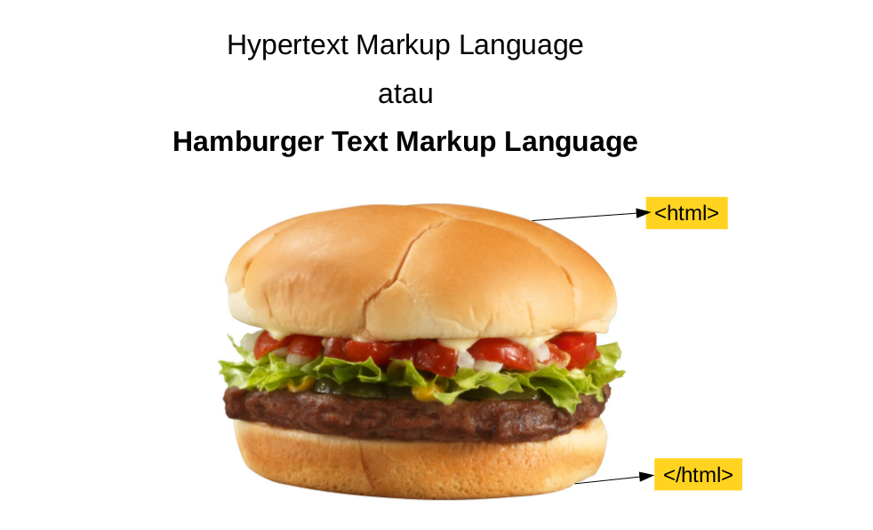
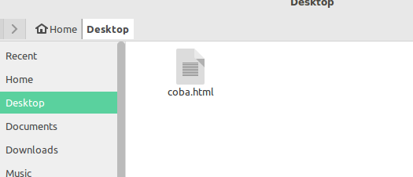
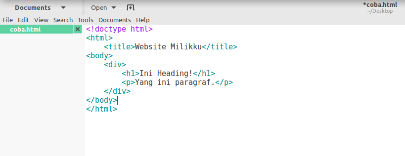

# Doscom University Web Programming
Selamat datang di Doscom University kelas Web Programming. Halaman ini ditujukan sebagai bekal untuk kita belajar sebelum pertemuan di kelas nanti.

Selamat Belajar :wink::wink:

## HTML
Singkatan dari Hypertext Markup Language, HTML adalah salah satu markup language yang menjadi dasar pembangunan halaman web. Bukan bahasa pemrograman yaa

HTML dibuat untuk merepresentasikan tampilan sebuah halaman web. Bukan sebagai bahasa pemrograman, HTML ini digunakan untuk menandai bagian-bagian halaman web, mana yang judul, mana yang sub judul, yang paragraf, baris, tabel, dan sebagainya.

Umumnya halaman web dibangun atas tiga unsur:
- HTML sebagai struktur tampilan: header, paragraf, tombol, dll.
- CSS memberi gaya dalam mempresentasikan halaman web (style): warna, ukuran, tata letak, dll.
- JavaScript, yang memiliki fungsional karena merupakan bahasa pemrograman.


Belajar HTML dan CSS bukan berarti kita sedang belajar pemrograman. Ya karena memang bukan bahasa pemrograman :smile::smile: . Namun kita dapat membuat halaman web dengan ini. Halaman web seperti ini biasa disebut web statis

Cara penulisan html kurang lebihnya seperti ini:

```html
<!doctype html>
<html>
    <title>Website Milikku</title>
<body>
    <div>
        <h1>Ini Heading!</h1>
        <p>Yang ini paragraf.</p>
    </div>
</body>
</html>
```

Jika kita perhatikan teks di atas memiliki sesuatu yang dikurung dengan kurung siku `<>`. Ini disebut dengan tag html.
Tag html memiliki tag pembuka `<tag>` dan tag penutup `</tag>` (ada beberapa tag yang tidak perlu tag penutup). Format penulisannya seperti ~~krabby patty~~ burger / sandwich.

Karena itu HTML juga disebut Hamburger Text Markup Language.



Dalam dunia web, dokumen HTML yang benar memiliki dua bagian utama:
- Head dan meta data
- Body (badan HTML, bagian yang terlihat di halaman web)

Cobalah buat file baru dengan nama coba.html



Kemudian buka file coba.html itu dengan teks editor (gedit, notepad atau lainnya) dan copykan code html di atas tadi ke file ini



Simpan file .html ini lalu buka dengan browser.

Selamat mencoba :blush::blush:

---

---
## Persiapan Kelas Pertemuan Pertama
:dart: **Siapkan puisi!** Kita akan belajar membuat halaman web dengan puisi indah kita.
Sampai bertemu di kelas yaa :wink::wink:

### Referensi dan tambahan mengenai HTML

:bulb: [SoloLearn Course HTML](https://www.sololearn.com/Course/HTML/)
:bulb: [HTML by hacktiv8](https://github.com/hacktiv8/phase-0-activities/blob/master/modules/html5-basics.md)

---

---
credits: [hacktiv8](https://github.com/hacktiv8)
