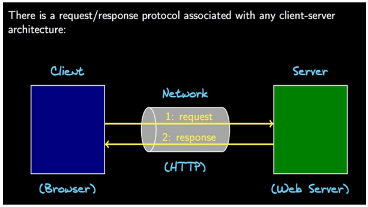
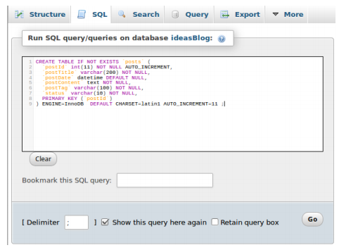

# CRUD (Create, Read, Update, Delete) dengan PHP dan mySql

### Cara kerja web



### mySql

- Buka phpmyadmin

- Buat database baru (beri nama misal: “blog”)

- Buat tabel posts berisi kolom masing-masing bernama:

   - postId (type: INT, length/value: 11, A_I: cek)

   - postTitle (type: VARCHAR, length: 200)

   - postDate (type: DATETIME)

   - postContent (type: TEXT)

   - postTag (type: VARCHAR, length: 100)

   - status (type: VARCHAR, length: 10)

Atau gunakan SQL Query berikut:
```SQL
CREATE TABLE IF NOT EXISTS 'posts' (
'postId' int(11) NOT NULL AUTO_INCREMENT,
'postTitle' varchar(200) NOT NULL,
'postDate' datetime DEFAULT NULL,
'postContent' text NOT NULL,
'postTag' varchar(100) NOT NULL,
'status' varchar(10) NOT NULL,
PRIMARY KEY ('postId')
) ENGINE=InnoDB DEFAULT CHARSET=latin1 AUTO_INCREMENT=11 ;
```

klik go

### Persiapan

- dengan browser, buka akun github [wkwksama](https://github.com/wkwksama/belajar-php-pdo)
- fork repo tersebut
- klik pada clone or download, copy link yang muncul
- buka terminal
- masukkan `cd /var/www/html` terus enter
- masukkan `sudo git clone [REPO GITHUB MILIKMU]`
- info: tadi menggunakan sudo karena memerlukan akses root di directory tersebut
- karena directory web server di linux memerlukan akses root, kita perlu melakukan beberapa perubahan
   - `sudo chmod -R 775 /var/www/html/belajar-php-pdo`
   - info: perintah ini digunakan untuk membuka hak akses directory agar bisa diedit tanpa perlu root
- buka link localhost/belajar-php-pdo

Selanjutnya buka project yang kita unduh tadi dengan teks editor (atom)

- Buat file connectDB.php
- Buat file addPost.php
- Buat file publishPost.php
- Buat file editPost.php
- Buat file deletePost.php

### Koneksi dengan PDO

- tulis kode ini di file connectDB untuk membuat koneksi database

```php
<?php

$host = 'localhost';
$username = 'root';
$password = 'root';
$database = 'nama_database';
$dbms = 'mysql';
$charset = 'utf8';
$db = null;
try {
    $db = new PDO("$dbms:host=$host;dbname=$database;charset=$charset", $username, $password);
    $db->setAttribute(PDO::ATTR_ERRMODE, PDO::ERRMODE_EXCEPTION);
    echo “koneksi berhasil”;
}
    catch(PDOException $e) {
    echo 'koneksi error :'.$e->getMessage();
}

?>
```
- Pada index.php setelah tag body (`<body>`) ketikkan kode berikut:

```php
<?php
include_once 'connecDB.php';
?>
```
- Halaman akan menampilkan pesan “koneksi berhasil” pada atas halaman.
- Jika terjadi error periksalah penulisan kode anda, seperti penulisan nama database, password, sintaks error dll.

### Create

- Tulis kode berikut ke file addPost.php

```php
<?php
include_once 'connectDB.php';
$query = "insert into posts values('', :postTitle, now(), :postContent, :postTag, :status);";
$run = $db->prepare($query);
$run->execute(array(
    ':postTitle' => $_POST['postTitle'],
    ':postContent' => $_POST['postContent'],
    ':postTag' => 'blog', ':status' => 'entry'
));
if ($run) {
    header("location:post_list.php");
}
else {
    echo 'error';
}
```

### Read

- Buka post_list.php tuliskan kode berikut pada tag table (`<table>`)

```php
<?php

include_once 'connectDB.php';
$query = "SELECT * FROM posts ORDER BY postDate DESC";
$run = $db->query($query);
foreach ($run as $value) {
    echo $value['postTitle'];
    echo date("d-M-Y",strtotime($value['postDate']));
    echo $value['status'];
    echo "<a href=\"form_edit.php?id=$value[postId]\">edit</a>";
    echo "<a href=\"deletePost.php?id=$value[postId]\">x</a>";
}
```

- Reload http://localhost/belajar-php-pdo/post_list.php maka data yang diinputkan akan terlihat (judul, tanggal, dan status)

Untuk melihat isi post kita akan membuat link dengan metode get post_view.php?id=$value[postId]
- Buka post_view.php tuliskan kode berikut

```php
<?php

include_once 'connectDB.php';
$id=$_GET['id'];
$query = "SELECT * FROM posts WHERE postID = $id";
$run = $db->query($query);
foreach ($run as $value) {
    echo $value['postTitle'];
    echo date("d-M-Y",strtotime($value['postDate']));
    echo $value['postContent']
}
```

- Klik pada salah satu judul post anda (semisal http://localhost/belajar-php-pdo/post_view.php?id=13)

Membuat hanya menampilkan post yang statusnya publish

- Buka index.php (hanya akan menampilkan post yang statusnya publish) tuliskan kode berikut untuk list post yang ditampilkan

```php
<?php
include_once 'connectDB.php';
$id=$_GET['id'];
$query = "SELECT * FROM posts WHERE status='publish' ORDER BY postDate DESC";
$run = $db->query($query);
foreach ($run as $value) {
    echo $value['postTitle'];
    echo date("d-M-Y",strtotime($value['postDate']));
}
```

### Update

Pada tahap ini jika kita membuka index.php maka tampilan list kosong, karena kita belum mempublish apapun.

- Tuliskan kode berikut kedalam file publishPost.php

```php
<?php
include_once 'connectDB.php';
$query = "update posts set status='publish' where postID=:key;";
$run = $db->prepare($query);
$run->execute(array(
    ':key' => $_GET['id']
));
if ($run) {
    header("location:post_list.php");
}
else {
    echo 'error';
}
```

- Buka file post http://localhost/belajar-php-pdo/post_list.php tekan tombol publish pada post yang anda inginkan.
- Lalu kembali ke index.php maka post yang ber status publish akan muncul.
- Untuk membuat update post, tuliskan kode berikut pada file updatePost.php

```php
<?php

include_once 'connectDB.php';
$query = "UPDATE posts SET postTitle= :postTitle, postContent= :postContent WHERE postId=:key;";
$run = $db->prepare($query);
$run->execute(array(
    ':key' => $_POST['postId'],
    ':postTitle' => $_POST['postTitle'],
    ':postContent' => $_POST['postContent']
));
if ($run) {
    header("location:post_list.php");
}
else {
    echo 'error';
}
```

- Kopikan file form_add.php pada form_edit, ubah actionnya menjadi "updatePost.php" lalu tambahkan kode berikut,

```php
<?php

include_once 'connectDB.php';
$id=$_GET['id'];
$query = "SELECT * FROM posts WHERE postID = $id";
$run = $db->query($query);
foreach ($run as $value) {
    echo "<input type=\"hidden\" name='postId' value='".$id."'>";
    echo "<textarea name='postTitle' rows='1' placeholder='Judul'>". $value['postTitle']."</textarea>";
    echo "<textarea name=\"postContent\" cols=\"30\" rows=\"20\" placeholder=\"Tulis Ide\">".$value['postContent']."</textarea>";
}
```

- Pilih salah satu post pada tampilan post_list.php lalu klik pada tombol update, maka akan muncul post anda dalam bentuk form yang dapat anda edit.

### Delete

- Buka file deletePost.php lalu ketikkan kode berikut.

```php
<?php

include_once 'connectDB.php';
$query = "delete from posts where postId=:key;";
$run = $db->prepare($query);
$run->execute(array(
    ':key' => $_GET['id']
));
if ($run) {
    header("location:post_list.php");
}
else {
    echo 'error';
}
```

- Simpan lalu coba hapus salah satu post anda.
